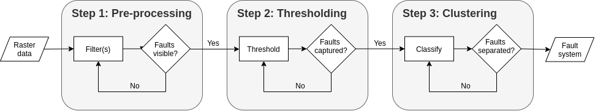

# Fault extraction and analysis
A python module for the extraction and analysis of faults (and fractures) in raster data. We often observer faults in 2-D or 3-D raster data (e.g. geological maps, numerical models or seismic volumes), yet the extraction of these structures still requires large amounts of our time. The aim of this module is to reduce this time by providing a set of functions, which can perform many of the steps required for the extraction and analysis of fault systems.

The basic idea of the module is to describe fault systems as graphs (or networks) consisting of nodes and edges, which allows us to define faults as components, i.e. sets of nodes connected by edges, of a graph. Nodes, which are not connected through edges, thus belong to different components (faults).

## Setup
Our module is build on top of several other packages (e.g. NumPy, Networkx), which are listed in ``` requirements.txt```. You can install these packages with:

``` pip install -r /path/to/requirements.txt ```

## Extraction


The extraction of faults from raster data typically involves three key steps: (1) pre-processing, (2) thresholding, and (3) clustering. The basic idea is that we first clean our data, then identify areas which belong to faults, and finally classify these areas into faults.


## Analysis
Once we have extracted a fault network, we can perform many of the steps of a fault analysis usign the functions of this module. For example, we can calculate fault lengths as the sum of the edge lengths (i.e. distances between connected nodes) of each component.


