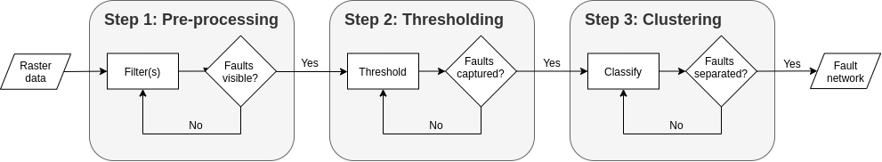

## Fault extraction

The extraction of faults from raster data typically involves three key steps: (1) pre-processing, (2) thresholding, and (3) clustering. The basic idea is that we first clean our data, then identify areas which belong to faults, and finally classify these areas into faults.
